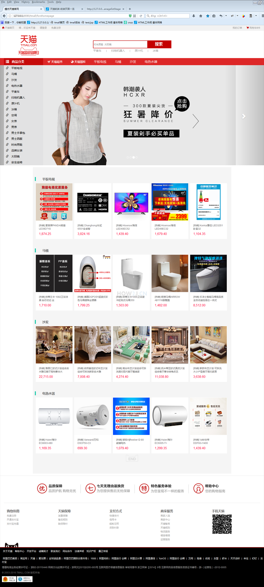
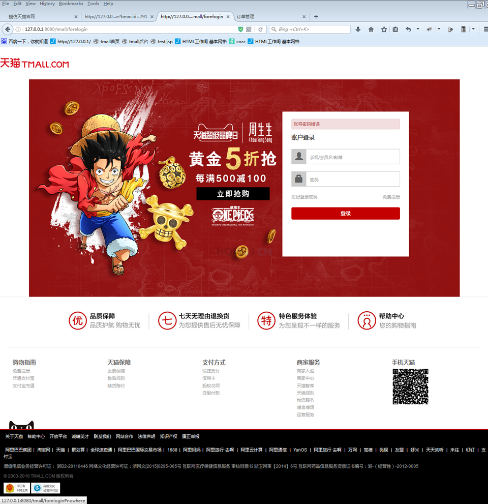
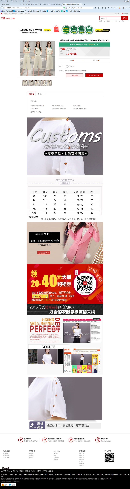
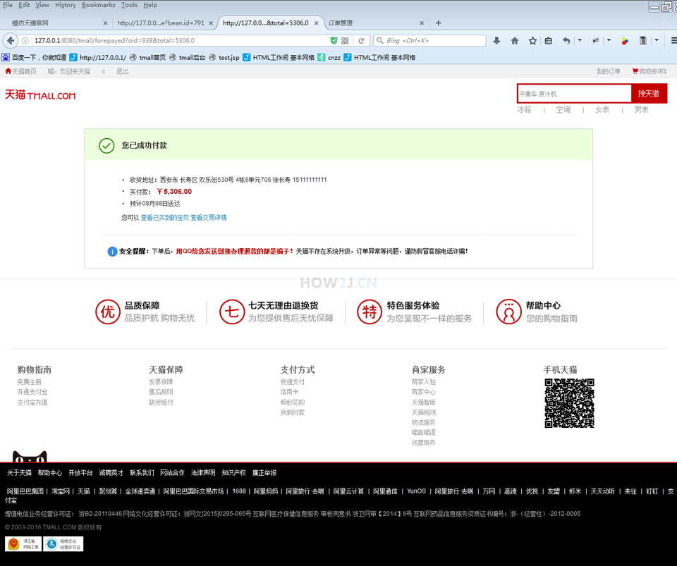
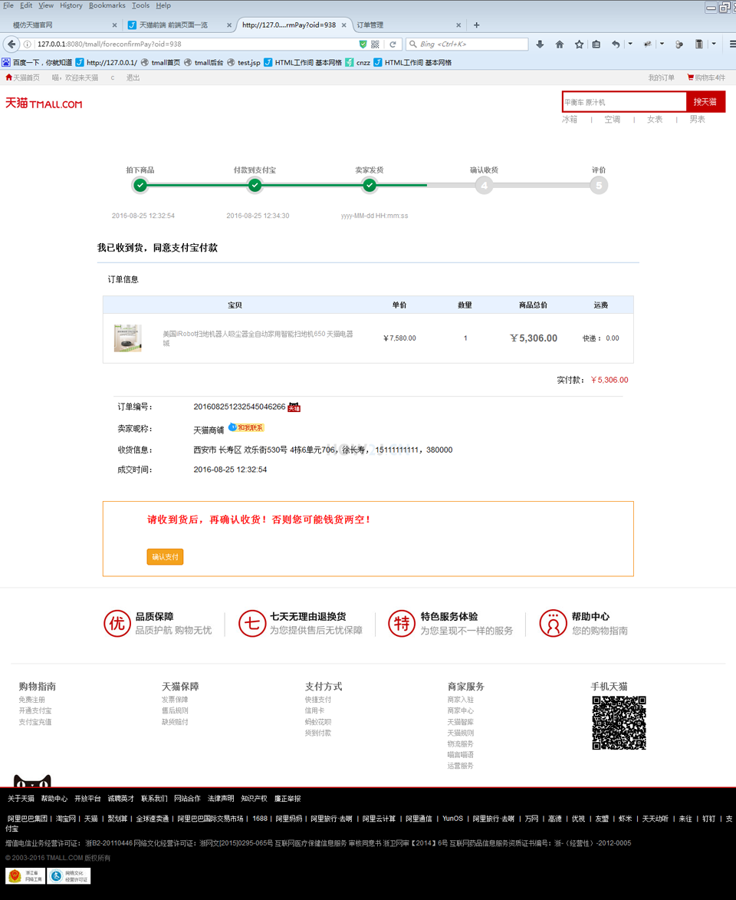
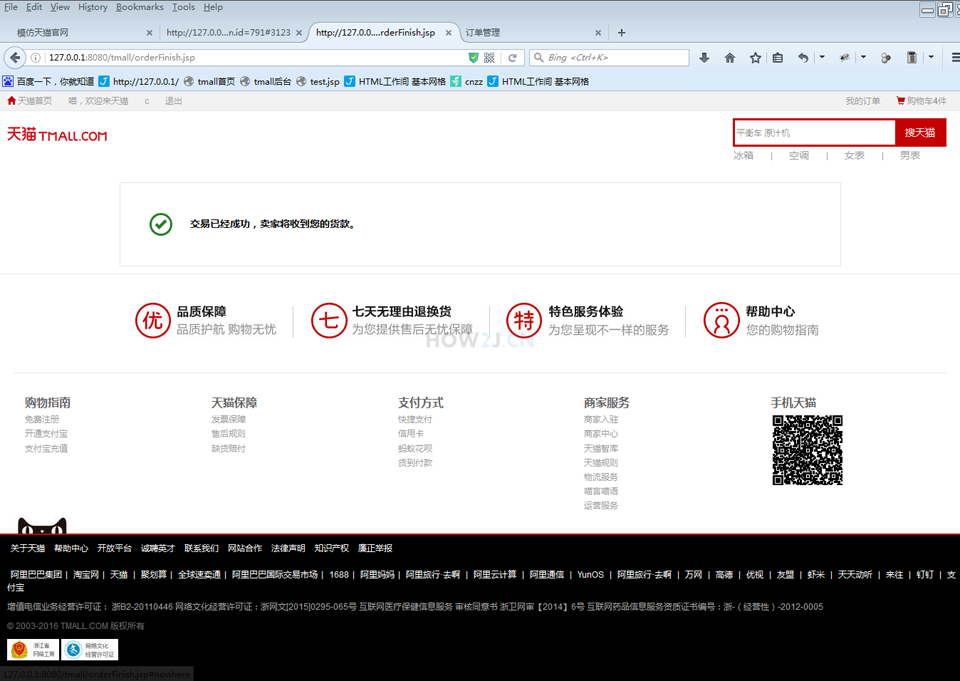

# TMALL Front End Practice

This is a front end simulation of the [tmall - the biggest b2c shopping website in China](https://www.tmall.com). The original idea comes from a project practice in a JAVA learning website: [how2j](http://how2j.cn/).

Most of the project are composed of **HTML, CSS and JQuery**, combined with a minor flavor of **bootstrap** (eg. carousel). The major pages are as below:

1. **Home page**

2. **Login**

3. **Registration**

4. **Category**

5. **Search results**

6. **Product**

7. **Shopping cart**

8. **Check-out**

9. **Pay**

10. **Receiving**

11. **Review**

12. **Order list**

### **Redistribution is NOT allowed, it is only for personal study!**
